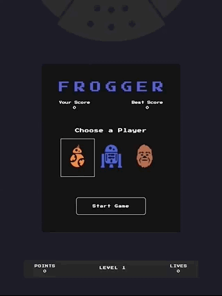

Frogger
===============================

The object of the game is to make it across without getting hit by enemies. Collect tokens along the way to earn points!

## Dependencies
- Game engine and resources.js provided by Udacity
- `dialog-polyfill.js` and `dialog-polyfill.css` (included from github.com/GoogleChrome/dialog-polyfill)
- Images from Starwars Icon # 153305 - Millennium Falcon Icon | Free Star Wars Iconset | Sensible World
http://chittagongit.com/icon/starwars-icon-26.html
- Sounds (sources listed in index.html)

## How to run the game
1. Clone this repo
2. Open `index.html` file in browser (tested with Chrome v 66.0.3359.139 and Safari v 11.1)
3. Play game!

## How to play

Choose a player and start game (click or use arrows + enter keys) and use arrow keys to move.

Have fun!